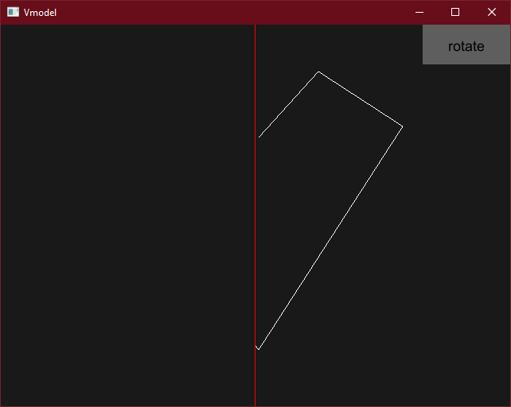
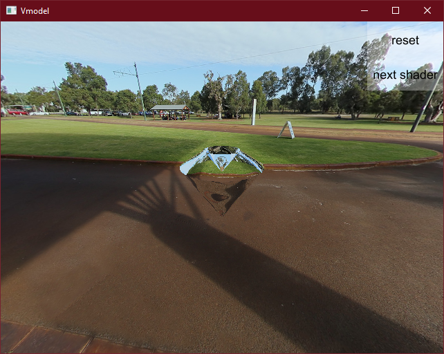

# RotGlass
With RotGlass I intended to explore pure formula based ray tracing glass. The project was built on [glui](https://github.com/frontier789/glui.git) and requires OpenGL 4.4 at least.

## Usage
After compilation the application can be run without any arguments. The opening window shows a red vertical line and a *rotate* button. 

The user can draw a line strip, adding new end points by clicking with the left mouse button.

After clicking the rotate button, the view switches to 3D and the rotational body implied by the line strip is shown. The view can be rotated by holding left mouse button and hovering.

## Compilation
The project uses cargo, compilation is simply done by running `cargo build` in the root direectory. Cargo then pulls and compiles dependencies. Running the application can be done via cargo as `cargo run --release`. \
OpenGL 4.4 required, tested only on Windows, but should work on any platform where Glutin works.

## Screenshots

### Drawn line strip of 5 points.

### Result of the above line strip

